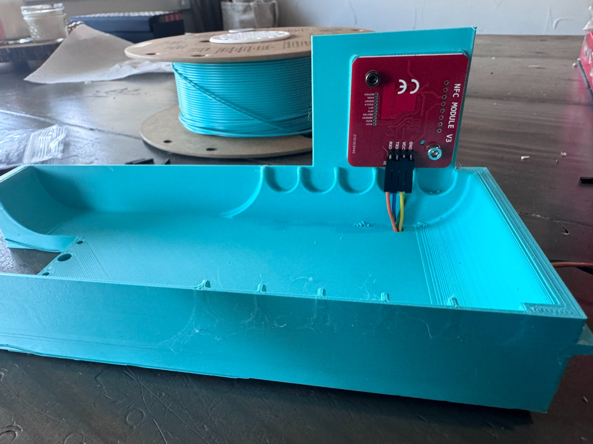

# AFC / BoxTurtle NFC Integration

> **OUTDATED — This document needs a full rewrite to reflect the current PN5180 scanner firmware. Will be updated soon.**

NFC spool scanning for [BoxTurtle](https://github.com/ArmoredTurtle/BoxTurtle) and other AFC-based filament changers. A SpoolSense Scanner per lane integrates with the [AFC-Klipper Add-On](https://github.com/ArmoredTurtle/AFC-Klipper-Add-On) via Spoolman.

## How It Works

Place a spool on a BoxTurtle lane → NFC tag rotates into the reader → middleware looks up the spool in Spoolman → calls `SET_SPOOL_ID` in AFC → AFC pulls color, material, weight automatically → lane LED shows filament color.

## 3D Printed Tray

A modified BoxTurtle tray with a built-in NFC reader mounting area is available in the `3mf/` folder.

## Help Wanted

- **Testers** — If you have a BoxTurtle, try this out and report back. Open an issue with your findings.
- **CAD help** — The current tray STL is a functional prototype. If you have CAD skills and want to help improve the NFC reader mount, cable routing, or overall fit, contributions are welcome.

## Requirements

- BoxTurtle with AFC-Klipper Add-On installed
- SpoolSense Scanner (PN5180-based)
- Spoolman with `nfc_id` extra field configured
- Klipper + Moonraker
- MQTT broker
